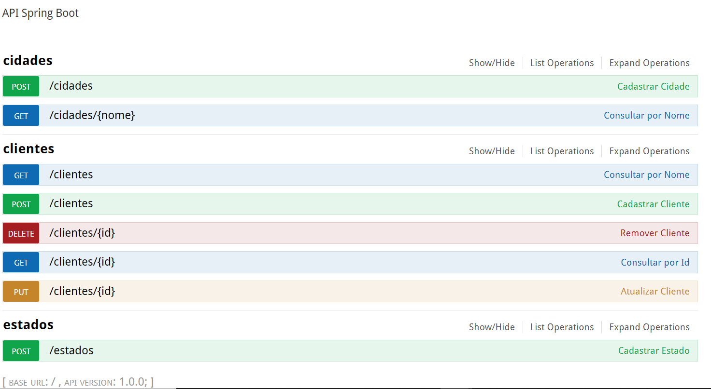

# desafio-api

Exemplo de aplicação utilizando Spring boot

### Tools

- Java SE Development Kit (min 8.0)
- Spring Tools IDE
- Maven
- Docker
- Postgres/H2
- Git

## Contruído Com:

- [Spring Boot](https://spring.io/projects/spring-boot)
- [Maven](https://maven.apache.org/)

## Executar

```sh
$ mvn clean install-DskipTests=true
$ docker-compose up
$ docker ps
```

http://localhost:8080/swagger-ui.html#/




